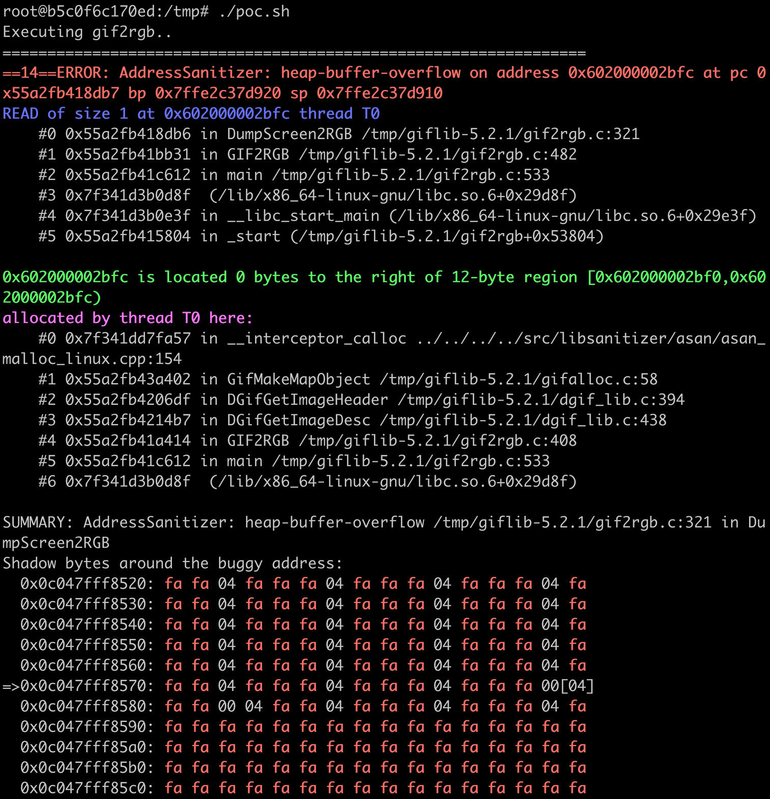
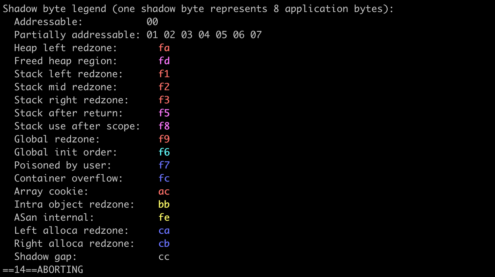

<p align="center">
  
</p>

# TACE


## Description

Taint Assisted Concolic Execution (TACE) utilizes the concept of taint in symbolic execution to identify all sets of dependent symbols. TACE can evaluate a subset of these sets with a significantly reduced testing effort by concretizing some symbols from selected subsets. The remaining subsets are explored with symbolic values. TACE optimizes symbolic constraints, facilitating a streamlined symbolic execution process that emphasizes the critical aspects of program behavior. Doing so contributes to a more practical and scalable approach for identifying vulnerabilities, generating comprehensive test suites, and aiding software security analysis. TACE stands out as an ideal tool for uncovering real vulnerabilities in applications, owing to its substantial enhancements in the realms of constraint solving and fuzzing. This makes it a highly effective asset in the practice of software analysis.


## Architecture

<p align="center">

</p>


The above figure illustrates the hybrid fuzzing architecture of TACE. The input source project is compiled with TACE and AFL-Clang to generate a TACE-instrumented binary and an AFL-instrumented binary, respectively. As TACE uses the underlying architecture of SymCC, it uses SymCChelper to generate inputs from the TACE-instrumented binary. AFL generates the initial seed for the AFL-instrumented binary. The AFL-instrumented binary is fuzzed to explore unique crashes and generate new inputs. The seeds generated by SymCChelper are only retained if they explore previously unseen paths. The collected seeds are used to fuzz the input program and generate new seeds.


## How to build TACE

A Docker container has been created for TACE, which is built upon SymCC, QEMU, and LLVM. This approach ensures a streamlined and user-friendly setup process, as the containerization effectively manages compatibility and dependency issues. During the build phase, the necessary dependencies are installed, and TACE patches are applied to the relevant components. Tested on Ubuntu LTS 22.04.1


0. Install  Docker Engine. For Ubuntu-specific guidance, refer to https://docs.docker.com/engine/install/ubuntu/ for detailed information.

1. Clone the git repository of TACE:
   ```
   git clone https://github.com/tacetool/TACE
   ```

3. Build the docker container:
	```
	cd TACE/tace && sudo docker build -t tace -f TACE_docker .
	```

4. Run and test the docker
	```
	sudo docker run -it --rm tace /bin/bash
	```


> The above steps have successfully built the TACE Docker container, which is now ready for use.
> All necessary patches are applied. Updating the Dockerfile to use other source repos is possible.

## Getting Started with TACE

Once the command `sudo docker run -it --rm tace /bin/bash` is executed, the environment becomes ready for use.

#### A. Constraints Solving with TACE

`symex2.c` has been designed for demonstration purposes, closely mirroring real-world projects with its numerous if-then-else branches that make achieving complete code coverage a challenging task.

Example source code for `symex2.c`:
```cpp 
//symex2.c
#include <stdio.h>
#include <stdlib.h>

int main(int argc, char *argv[])
{
    char *file = argv[1];
    char str[2000];//tainted buffer
    int fsize;
    int check=0, i;
    FILE *fp = fopen(file, "r");
    fseek(fp, 0, SEEK_END); // seek to end of file
    fsize = ftell(fp); // get current file pointer
    fseek(fp, 0, SEEK_SET); // seek back to beginning of file
	if(fsize<40 || fsize>1999)
		return -1;
    fread(str, sizeof(char), fsize, (FILE*)fp);
    for(i=0;i<(fsize-6);i++)
    {
      if((str[i]+str[i+1])<(str[i+3]+str[i+4]+str[i+5]))
	check++;
    }
	// push constraint from loop
	if(check<1)
	{
		printf("too many large chars. Exiting!\n");
		return -1;
	}
    if(str[7] + str[5] == 'R')
    {
        printf("branch 1\n");
        if(str[18] + str[19] == 'b')
        {
            //some code
            printf("branch 2\n");
            if(str[2] + str[4] == 'X')
                {
                    printf("unrelated branch 1\n");
                }
            if(str[4] + str[8] == 'X')
                {
                    printf("unrelated branch 2\n");
                }
            if(str[15] + str[18] == 'U')
            {
                printf("branch 3\n");
                if(str[5] + str[9] == 'X')
                {
                    printf("unrelated branch 3\n");
                }
                if(str[11] + str[24] == 'X')
                {
                    printf("unrelated branch 4\n");
                }
                if(str[15] + str[14] == 'g')
                {
                    printf("vulnerable branch 4\n");
                    //vulnerable_function(&str[30]);
                    abort();
                }
                else
                    printf("branch 5\n");
             }
            else
              printf("branch 6\n");
        }
    }
    printf("branch 0\n");
 	return 0;
 }

```

After running Docker, the WORKDIR is established as the `/tmp` folder. Here, you will  find the previously mentioned source code. The backend typically manages input from STDIN by default. However, to designate a specific file as symbolic, you can set the `SYMCC_INPUT_FILE` variable. For changing where output files are saved, use the `SYMCC_OUTPUT_DIR` variable


To run a simple case (where the workdir is `/tmp`), use the following command:

```
cc -O2 symex2.c -o test.elf
echo 'AAAAAAAAAAAAAAAAAAAAAAAAAAAAAAAAAAAAAAAAAAAAAAAAAAAAAAAAAAAAAAAAAAAAAAAAAAA' > input
SYMCC_INPUT_FILE=/tmp/input SYMCC_OUTPUT_FOLDER=/tmp/output taceqemu /tmp/test.elf /tmp/input
```

Example of output:

```cpp 
FOR TREE 0x55e94ea2a040 :: SYMDEP [ ], CONCRETE DEP [ ]

[STAT] SMT: {"solving_time_elapsed": 1242 }
[INFO] New testcase: /tmp/output/000000
[Solver::addJcc] isInteresting=true


FOR TREE 0x55e94ea01650 :: SYMDEP [ 1 4 5 ], CONCRETE DEP [ 0 3 ]


FOR TREE 0x55e94ea2a040 :: SYMDEP [ 1 4 5 ], CONCRETE DEP [ 0 3 ]


FOR TREE 0x55e94eb63420 :: SYMDEP [ 1 4 5 ], CONCRETE DEP [ 0 3 ]

[STAT] SMT: {"solving_time_elapsed": 1429 }
[INFO] New testcase: /tmp/output/000001
[Solver::addJcc] isInteresting=true


FOR TREE 0x55e94ea01650 :: SYMDEP [ 2 3 5 6 ], CONCRETE DEP [ 0 1 4 ]


FOR TREE 0x55e94eb29150 :: SYMDEP [ 2 3 5 6 ], CONCRETE DEP [ 0 1 4 ]

[STAT] SMT: {"solving_time_elapsed": 1686 }
[INFO] New testcase: /tmp/output/000002
[Solver::addJcc] isInteresting=true


FOR TREE 0x55e94ea01650 :: SYMDEP [ 3 4 6 7 ], CONCRETE DEP [ 0 1 2 5 ]


FOR TREE 0x55e94eb26290 :: SYMDEP [ 3 4 6 7 ], CONCRETE DEP [ 0 1 2 5 ]

[STAT] SMT: {"solving_time_elapsed": 1905 }
[INFO] New testcase: /tmp/output/000003
[Solver::addJcc] isInteresting=false

```

Printed log demonstrates state of the current tree, location of the test case, solving time, and considered dependencies.

#### B. Fuzzing with TACE (target: TCPDump)


Build LibCap with TACE.
```
mkdir /tace_build
cd /tace_build
git clone  https://github.com/the-tcpdump-group/libpcap.git      
cd libpcap && ./autogen.sh
CC=/symcc_build/tace ./configure
make && make install

```


Build TCPDump with TACE.
```
git clone  https://github.com/the-tcpdump-group/tcpdump.git
cd tcpdump &&./autogen.sh
CC=/symcc_build/tace ./configure
make && make install
```

Similarly, build LibCap and TCPDump with AFL-clang. 

```
mkdir /afl_build
cd /afl_build
git clone https://github.com/the-tcpdump-group/libpcap.git
git clone https://github.com/the-tcpdump-group/tcpdump.git
export AFL_USE_ASAN=1
cd libpcap
./autogen.sh
CC=/afl/afl-clang ./configure
make && make install
cd /afl_build/tcpdump/
./autogen.sh
CC=/afl/afl-clang ./configure
make && make install

```


Run the Fuzz campaign with TACE.

```
mkdir /corpus && mkdir /fuzz_res && mkdir /fuzz_res/afl_out/
echo "AAAAAAAA" > /corpus/seed 
/afl/afl-fuzz -M afl-master -i /corpus/ -o /fuzz_res/afl_out/ -m none -- /afl_build/tcpdump/tcpdump -e -r @@
/afl/afl-fuzz -S afl-secondary -i corpus/ -o /fuzz_res/afl_out/ -m none -- /afl_build/tcpdump/tcpdump -e -r @@
~/.cargo/bin/symcc_fuzzing_helper -o /fuzz_res/afl_out/ -a afl-secondary -n tace -- /tace_build/tcpdump/tcpdump -e -r @@

```
<p align="center">

</p>

------------------------------------------------------------


## Giflib 5.2.1 Heap buffer overflow (CVE-2023-48161)

Affected version : Giflib Version 5.2.1


### Vulnerability Description
A heap buffer overflow vulnerability exists in the DumpScreen2RGB function within the gif2rgb.c component of GifLib 5.2.1 specifically between lines 321 and 323. The flaw can be exploited when handling a specially crafted GIF during the image-saving process. It is important to note that this issue is distinct from CVE-2022-28506. While the [5b74cd] commit effectively addresses CVE-2022-28506, it does not provide a resolution for this particular heap-buffer overflow problem.

The crash reproduction files and data is available in folder `TACE/tace/giflib-crash/giflib521/`.

### Replicating the Vulnerability

The heap buffer overflow detected by TACE is easily replicable using the provided Docker image.
To replicate the CVE-2023-48161 vulnerability, execute the `POC_crash_docker` from the `TACE/tace/giflib-crash/giflib521/` directory.

STEP 1(Build the Docker image):
```
sudo docker build --rm -t giflib-vuln -f POC_crash_docker .
```
STEP 2( Running rhe container):
```
sudo docker run -it --rm giflib-vuln /bin/bash
```

STEP 3 (Running rhe PoC bas script):
```
./poc.sh
```
------------------------------------------------



------------------------------------------------

Address sanitizer output (Heap-based Overflow)



------------------------------------------------

### Files Description
1. crashes.zip ==>  contains the sample which can trigger the crash.

2. poc.sh ==> contains a bash script that executes the vulnerable gif2rgb program with the input that triggers the crash.

3. POC_crash_docker  ==> dockerfile to create the environment and setup giflib 5.2.1 for easy bug replication.


### GifLib Installation without Docker

Environment: Ubuntu 22.04 LTS
```
wget https://yer.dl.sourceforge.net/project/giflib/giflib-5.2.1.tar.gz

tar -xf giflib-5.2.1.tar.gz

cd giflib-5.2.1

make CFLAGS="-std=gnu99 -fPIC -Wall -Wno-format-truncation -ggdb -fsanitize=address,undefined,leak,integer -fno-omit-frame-pointer"
```
Replicate the crash: `./giflib-5.2.1/gif2rgb -o out /tmp/crashes/sample`

----------------------------------------------------------------------

## License

Extends the QEMU,SYMCC,SYMQEMU,SQYM , and our contributions to previously existing
files adopt those files' respective licenses; the files that we have added are
made available under the terms of the GNU General Public License as published by
the Free Software Foundation, either version 2 of the License, or (at your
option) any later version.
