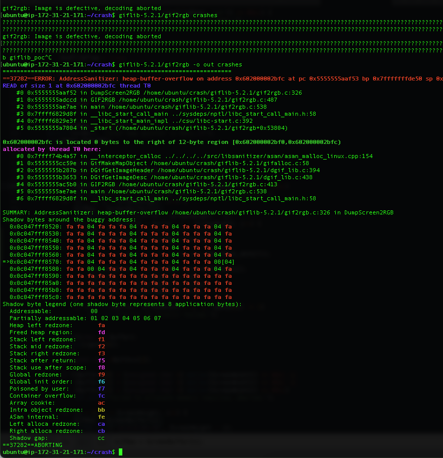

<p align="center">
  
</p>

# TACE


## Description

Taint Assisted Concolic Execution (TACE) utilizes the concept of taint in symbolic execution to identify all sets of dependent symbols. TACE can evaluate a subset of these sets with a significantly reduced testing effort by concretizing some symbols from selected subsets. The remaining subsets are explored with symbolic values. TACE optimizes symbolic constraints, facilitating a streamlined symbolic execution process that emphasizes the critical aspects of program behavior. Doing so contributes to a more practical and scalable approach for identifying vulnerabilities, generating comprehensive test suites, and aiding software security analysis. This paper explores TACE's capabilities, illustrating how it leverages constraint debloating to advance symbolic execution techniques and significantly improve software analysis practices.


## Architecture

<p align="center">

</p>


The above figure illustrates the hybrid fuzzing architecture of TACE. The input source project is compiled with TACE and AFL-Clang to generate a TACE-instrumented binary and an AFL-instrumented binary, respectively. As TACE uses the underlying architecture of SymCC, it uses SymCChelper to generate inputs from the TACE-instrumented binary. AFL generates the initial seed for the AFL-instrumented binary. The AFL-instrumented binary is fuzzed to explore unique crashes and generate new inputs. The seeds generated by SymCChelper are only retained if they explore previously unseen paths. The collected seeds are used to fuzz the input program and generate new seeds.


## How to build
This is a binary-only symbolic/concolic executor based on QEMU, SymCC, and TACE. 
To understand the build steps, please check (Dockefile)[Dockefile]. It is considered a self-documented step.
The build happens through several stages of building foundations where TACE patches 
are applied to required components.

To build a test case, it is enough to do the following:

> Please install docker depending on the system you use.

```
docker build -t tace -f Dockefile .
docker run -it --rm tace /bin/bash
```

> This will build the required docker container and environment, which is ready to go for development.
>
> All necessary patches are applied. Updating the Dockerfile to use other source repos is possible.

## How to run a basic example

A basic example program that represents an approach where bloating of symbolic deps happens due to deps between branches.

```cpp 
//symex2.c
#include <stdio.h>
#include <stdlib.h>

int main(int argc, char *argv[])
{
    char *file = argv[1];
    char str[2000];//tainted buffer
    int fsize;
    int check=0, i;
    FILE *fp = fopen(file, "r");
    fseek(fp, 0, SEEK_END); // seek to end of file
    fsize = ftell(fp); // get current file pointer
    fseek(fp, 0, SEEK_SET); // seek back to beginning of file
	if(fsize<40 || fsize>1999)
		return -1;
    fread(str, sizeof(char), fsize, (FILE*)fp);
    for(i=0;i<(fsize-6);i++)
    {
      if((str[i]+str[i+1])<(str[i+3]+str[i+4]+str[i+5]))
	check++;
    }
	// push constraint from loop
	if(check<1)
	{
		printf("too many large chars. Exiting!\n");
		return -1;
	}
    if(str[7] + str[5] == 'R')
    {
        printf("branch 1\n");
        if(str[18] + str[19] == 'b')
        {
            //some code
            printf("branch 2\n");
            if(str[2] + str[4] == 'X')
                {
                    printf("unrelated branch 1\n");
                }
            if(str[4] + str[8] == 'X')
                {
                    printf("unrelated branch 2\n");
                }
            if(str[15] + str[18] == 'U')
            {
                printf("branch 3\n");
                if(str[5] + str[9] == 'X')
                {
                    printf("unrelated branch 3\n");
                }
                if(str[11] + str[24] == 'X')
                {
                    printf("unrelated branch 4\n");
                }
                if(str[15] + str[14] == 'g')
                {
                    printf("vulnerable branch 4\n");
                    //vulnerable_function(&str[30]);
                    abort();
                }
                else
                    printf("branch 5\n");
             }
            else
              printf("branch 6\n");
        }
    }
    printf("branch 0\n");
 	return 0;
 }

```

Once docker is run, WORKDIR is set up for `/tmp` folder.
You might find there the source above, created folder for the cases and garbage.
By default, the backend handles STDIN input, but to specify a file that should be treated as symbolic, use  the `SYMCC_INPUT_FILE` variable. If you want to change the output folder location, use the `SYMCC_OUTPUT_DIR` variable. Check below

To run simple case(workdir=/tmp):

```
cc -O2 symex2.c -o test.elf
echo 'AAAAAAAAAAAAAAAAAAAAAAAAAAAAAAAAAAAAAAAAAAAAAAAAAAAAAAAAAAAAAAAAAAAAAAAAAAA' > input
SYMCC_INPUT_FILE=/tmp/input SYMCC_OUTPUT_FOLDER=/tmp/output taceqemu /tmp/test.elf /tmp/input
```

Example of output:

```
FOR TREE 0x55e94ea2a040 :: SYMDEP [ ], CONCRETE DEP [ ]

[STAT] SMT: {"solving_time_elapsed": 1242 }
[INFO] New testcase: /tmp/output/000000
[Solver::addJcc] isInteresting=true


FOR TREE 0x55e94ea01650 :: SYMDEP [ 1 4 5 ], CONCRETE DEP [ 0 3 ]


FOR TREE 0x55e94ea2a040 :: SYMDEP [ 1 4 5 ], CONCRETE DEP [ 0 3 ]


FOR TREE 0x55e94eb63420 :: SYMDEP [ 1 4 5 ], CONCRETE DEP [ 0 3 ]

[STAT] SMT: {"solving_time_elapsed": 1429 }
[INFO] New testcase: /tmp/output/000001
[Solver::addJcc] isInteresting=true


FOR TREE 0x55e94ea01650 :: SYMDEP [ 2 3 5 6 ], CONCRETE DEP [ 0 1 4 ]


FOR TREE 0x55e94eb29150 :: SYMDEP [ 2 3 5 6 ], CONCRETE DEP [ 0 1 4 ]

[STAT] SMT: {"solving_time_elapsed": 1686 }
[INFO] New testcase: /tmp/output/000002
[Solver::addJcc] isInteresting=true


FOR TREE 0x55e94ea01650 :: SYMDEP [ 3 4 6 7 ], CONCRETE DEP [ 0 1 2 5 ]


FOR TREE 0x55e94eb26290 :: SYMDEP [ 3 4 6 7 ], CONCRETE DEP [ 0 1 2 5 ]

[STAT] SMT: {"solving_time_elapsed": 1905 }
[INFO] New testcase: /tmp/output/000003
[Solver::addJcc] isInteresting=false

```

Printed log demonstrates state of the current tree, location of the test case, solving time, and considered dependencies

## Fuzzing Experiments

**Environment set-up**
```
sudo bash -c “echo core >/proc/sys/kernel/core_pattern”
cd /sys/devices/system/cpu
sudo bash -c “echo performance | tee cpu*/cpufreq/scaling_governor”

```

**Fuzzing Target** TCPDump

Build LibCap with TACE.
```
mkdir /tace_build
cd /tace_build
git clone  https://github.com/the-tcpdump-group/libpcap.git      
./autogen.sh
CC=/symcc_build/tace ./configure
make
```


Build TCPDump with TACE.
```
git clone  https://github.com/the-tcpdump-group/tcpdump.git
cd tcpdump
./autogen.sh
CC=/symcc_build/tace ./configure
make
```

Similarly, build LibCap and TCPDump with AFL-Clang. 
```
Inside AFL_BUILD directory
mkdir /afl_build
cd /afl_build
git clone https://github.com/the-tcpdump-group/libpcap.git
git clone https://github.com/the-tcpdump-group/tcpdump.git
export AFL_USE_ASAN=1
cd libpcap
./autogen.sh
CC=/afl/afl-clang ./configure
make


cd tcpdump
./autogen.sh
CC=/afl/afl-clang ./configure
make
```


Run the Fuzz campaign with TACE.
```
mkdir /corpus
echo “AAAAAAAA” > corpus/seed/afl/afl-fuzz -M afl-master -i /corpus/ -o /fuzz_res/afl_out/ -m none -- afl_build/tcpdump/tcpdump -e -r @@
/afl/afl-fuzz -S afl-secondary -i corpus/ -o /fuzz_res/afl_out/ -m none -- afl_build/tcpdump/tcpdump -e -r @@
~/.cargo/bin/symcc_fuzzing_helper -o /fuzz_res/afl_out/ -a afl-secondary -n tace -- tace_build/tcpdump/tcpdump -e -r @@


```

------------------------------------------------------------


## Giflib 5.2.1 Vuln Poc
Giflib Version 5.2.1


## Description
A heap buffer overflow vulnerability exists in the DumpScreen2RGB function within the gif2rgb.c component of GifLib 5.2.1 specifically between lines 321 and 323. The flaw can be exploited when handling a specially crafted GIF during the image-saving process. It is important to note that this issue is distinct from CVE-2022-28506. While the [5b74cd] commit effectively addresses CVE-2022-28506, it does not provide a resolution for this particular heap-buffer overflow problem.
The crash reproduction files and data is available in folder **giflib-crash/giflib521/**

## Installation via Dockerfile
docker build --rm -t giflib-vuln -f Dockerfile .

docker run -it --rm giflib-vuln /bin/bash

./poc.sh

------------------------------------------------


------------------------------------------------

Address sanitizer output (Heap-based Overflow)


------------------------------------------------

## Files Description
1. crashes.zip ==>  contains the sample which can trigger the crash.

2. poc.sh ==> contains a bash script that executes the vulnerable gif2rgb program with the input that triggers the crash.

3. Dockerfile ==> dockerfile to create the environment and setup giflib 5.2.1 for easy bug replication.


## Installation without Docker
Environment: Ubuntu 22.04 LTS

wget https://yer.dl.sourceforge.net/project/giflib/giflib-5.2.1.tar.gz

tar -xf giflib-5.2.1.tar.gz

cd giflib-5.2.1

make CFLAGS="-std=gnu99 -fPIC -Wall -Wno-format-truncation -ggdb -fsanitize=address,undefined,leak,integer -fno-omit-frame-pointer"

## Usage
./giflib-5.2.1/gif2rgb -o out /tmp/crashes/sample

----------------------------------------------------------------------

## Uniqueness of the Bug


We noticed a similar bug with **Fix heap-buffer overflow (CVE-2022-28506)** that was reported in the same file **gif2rgb.c** on line number 298. 
This  newly detected issue is separate from CVE-2022-28506 since it occurs specifically during the image-saving process. A patch was developed to remedy CVE-2022-28506, however the patch has not been integrated into the latest version of Giflib. 


Nevertheless, Fedora has taken the initiative to release an official patch to address the issue. https://bodhi.fedoraproject.org/updates/FEDORA-2022-964883b2a5

Even with the implementation of this patch, the newly discovered heap buffer overflow, which was detected by TACE on line 321 of the file gif2rgb.c, still remains exploitable.


In the provided proof of concept (POC) screenshot, it is evident that while the original CVE-2022-28506 is effectively mitigated after applying the patch, the newly identified heap buffer overflow issue within the image-saving process continues to persist and remains exploitable.




## License

Extends the QEMU,SYMCC,SYMQEMU,SQYM , and our contributions to previously existing
files adopt those files' respective licenses; the files that we have added are
made available under the terms of the GNU General Public License as published by
the Free Software Foundation, either version 2 of the License, or (at your
option) any later version.
